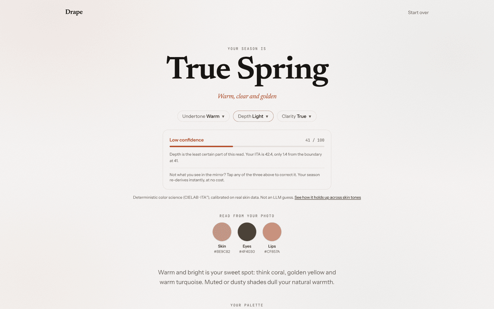
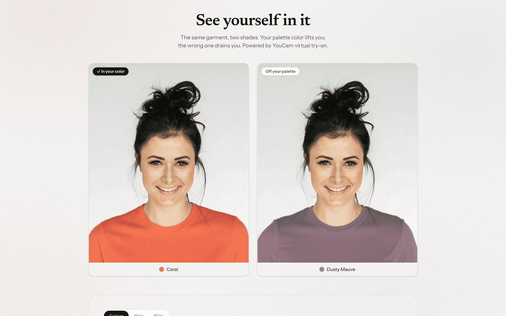
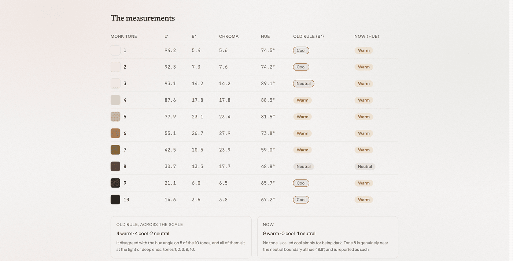
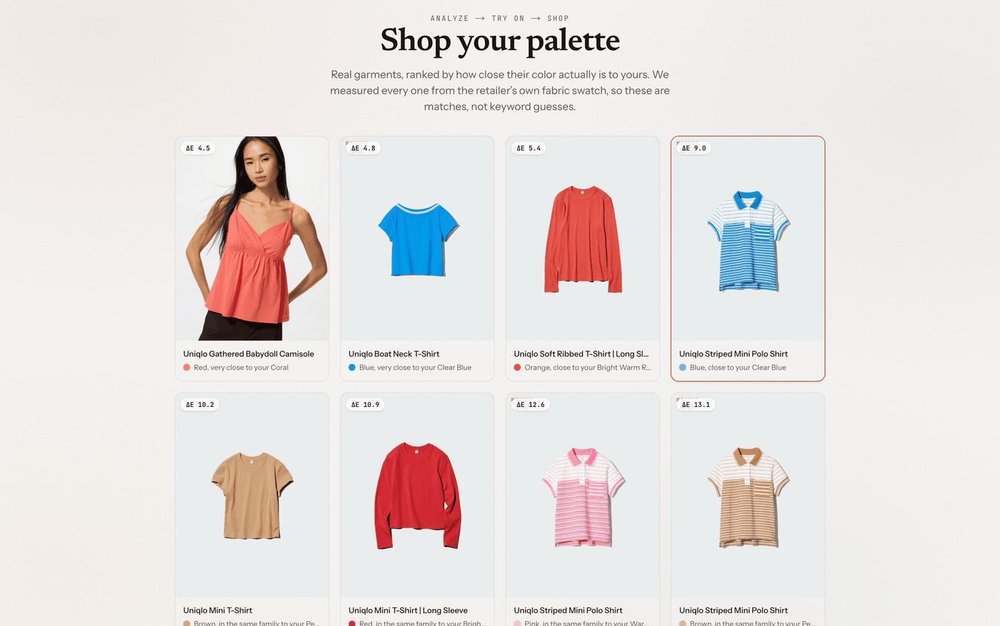
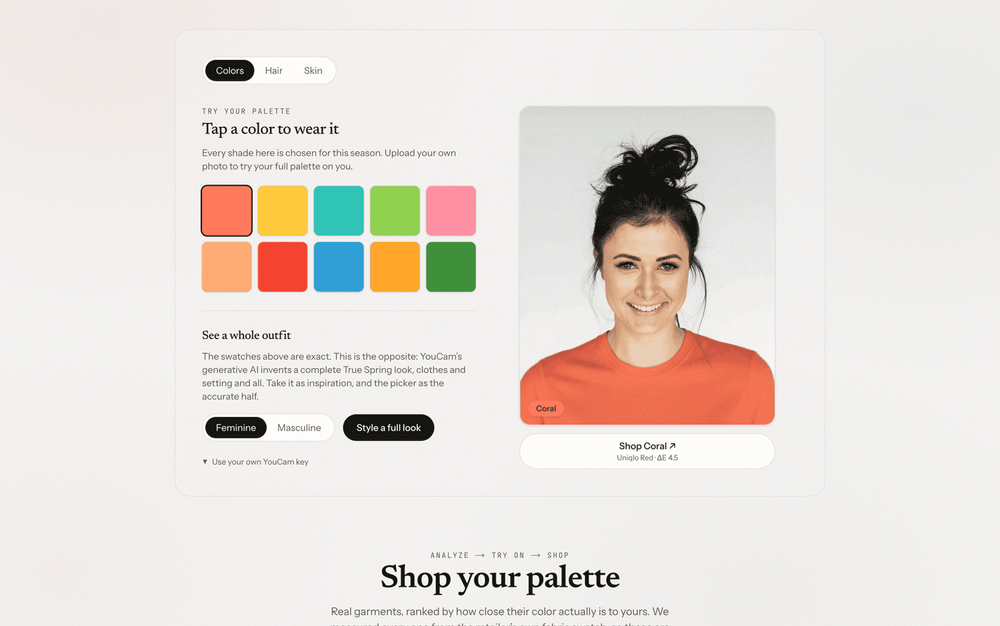

# Drape 🎨

**Find the colors made for you.** One selfie in; the colors that suit you out, worn on your
own photo and matched to clothes you can actually buy.

> **Live → https://drape-youcam.vercel.app** · [demo video](https://youtu.be/YUOCEw7yFx4)
> Built for the **YouCam API Skin AI & Apparel VTO Hackathon** (Perfect Corp) · combined track.



---

## The chain

Personal color analysis is a real $150 service: a stylist drapes fabric under your chin to see
which colors flatter you. Drape does it in twenty seconds, then makes it shoppable.

```
selfie → YouCam Skin Tone Analysis → skin #be9c82, eyes, lips, hair
       → our engine                → hue angle · ITA° · chroma → True Spring
       → palette                   → Coral #ff7a5c …
           ├── YouCam AI Clothes   → that exact hex, on your photo
           └── CIEDE2000           → real garments measured to match

plus, on the same read: AI Hair Color · generative styling · Skin Analysis
```

**The same hex flows all the way through.** `#ff7a5c` is what the try-on paints on you *and*
the target the catalog is measured against. That is what makes it a chain rather than three
features side by side.



## What's ours

The differentiator isn't the API call, it's the science in between. `lib/color/` makes **zero
network calls**, which is why corrections are free, sample faces cost nothing, and the MCP
server needs no credentials.

- **Undertone** from the CIELAB **hue angle**. We first thresholded b\* and found, testing
  against the [Monk Skin Tone Scale](https://skintone.google), that it read *darkness as
  coolness*: b\* is a magnitude, and chroma collapses at both ends of the human range. It got
  half the reference scale wrong. Rebuilt on hue angle, with before and after computed live at
  [`/fairness`](https://drape-youcam.vercel.app/fairness).
- **Depth** from **ITA°**, the dermatology-standard metric. **Clarity** from chroma and
  eye/skin contrast. Then a rule-based map to the 12 seasons.
- **Confidence**, from distance to a decision boundary plus YouCam's photo-quality flags. When
  it is unsure it says so, and you can overrule any axis: the season re-derives in the browser,
  free.



**207 tests** (`npm test`), including the 29-pair CIEDE2000 conformance set from Sharma, Wu &
Dalal (2005). They also hold the palettes to the standard we hold the shops to: no two swatches
in a season closer than ΔE 6, no two seasons sharing a color closer than ΔE 5. Both caught real
bugs.

## Shoppable, and measured



`lib/catalog.ts` ranks **353 real garments** by CIEDE2000. Every color is *measured from the
retailer's own fabric swatch* by `scripts/build-catalog.mjs`, never typed in by us: if we
picked the hex, a close match would be circular. Nothing past ΔE 15 is shown, and stock is
re-checked daily so the links stay live.

One Uniqlo product carries two colorways both called "Pink": `#fbe5e0` at ΔE 21.1, rejected,
and `#fa90a4` at ΔE 1.0, shown. Measurement separates them; a keyword search cannot.

## Also in here



| | |
|---|---|
| [`/fairness`](https://drape-youcam.vercel.app/fairness) | The Monk Skin Tone check, computed live from the shipping engine. |
| [`/retail`](https://drape-youcam.vercel.app/retail) | The same ranking inside a shop's product page, fully client-side. |
| [`/mcp`](https://drape-youcam.vercel.app/mcp) | The engine as an MCP server, with a live console. Agent docs at [`/llms.txt`](https://drape-youcam.vercel.app/llms.txt). |

Perfect Corp ships YouCam over MCP already, so an agent can get the hex values of a face. It
cannot turn those into a season, a palette, or ranked garments. Four tools do that, needing no
YouCam key of their own: `analyze_season`, `find_garments`, `check_color` and `correct_read`.

```jsonc
{ "mcpServers": { "drape": { "type": "http", "url": "https://drape-youcam.vercel.app/api/mcp" } } }
```

## Run it

```bash
npm install
cp .env.example .env.local   # YouCam API key + secret
npm run dev
npm test
```

Keys from <https://yce.perfectcorp.com>, server-side only: S2S auth is RSA-PKCS#1-v1.5 to a
short-lived token, and the key never reaches the browser. Testers can paste their own key into
the UI to run on their units instead.

Next.js 16 · React 19 · TypeScript · Tailwind v4 · `sharp` · Vitest · Vercel.

```
lib/color/     CIELAB, hue-angle undertone, 12 seasons, confidence, CIEDE2000  (pure)
lib/catalog.ts 353 measured garments + matching     lib/youcam/  S2S client (server-only)
app/           / · /fairness · /retail · /mcp       app/api/     analyze · tryon · skin ·
components/    Landing · Capture · Reveal ·                      styled · hair ·
               TryOnStudio (Colors/Hair/Skin tabs)               availability · mcp
```

---

Drape · Skin AI + Apparel VTO · Built on the YouCam API by Perfect Corp.
